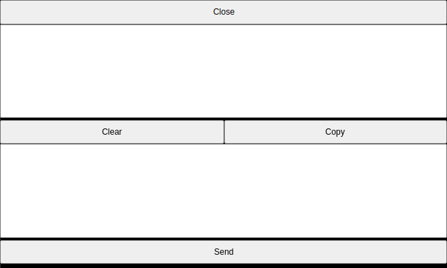

# Clipboard alternative interface

This **TextPaint** normally uses the clipboard interface provided by web browser\. In some cases, the interface is not available and in such case, there is an alternative clipboard interface\.

The anternative interface will be shown everytime, when you are trying to copy text into clipboard\. The easiest way to invoke the interface, is drag moise across the screen to copy the text fragment shown in the screen\.

The interface consists of the following elements:

* **Close button** \- Close the interface
* **Upper text field** \- Holds the text copied into clipboard\.
* **Clear button** \- Clear the lower text field\.
* **Copy button** \- Copy the text from the upper to the lower field\.
* **Lower text field** \- Text ready to paste or use as keystrokes\.
* **Send button** \- Cend the text from the bottom fields as keystrokes\.

# Screen copy

Everytime, you can copy any fragment of the screen by drag the mouse across the screen fragment diagonal\.

If the clipboard is available, the text will be simply copied into the clipboard\.

Otherwise, the interface will be invoked and the text will be written in the upper text field\.

# Text editor

The text editor has own the copy and paste commands\. When the clipboard is unavailable, every copy command will invoke the interface and will place the copied text into the upper field\.

The text paste in the editor are made by two ways:

* **Lower text field is empty** \- The pasted text will be get from the internal buffer, which preserves the color and attributes\.
* **Lower text field is fullfilled** \- The text from the field will be pasted as plain text\.

The text to paste must be prepared before invoke the paste command\. You can manually invoke the interface by copying comething or gragging the screen\.

Tnen, prepare the text in the lower text field\. The next step can be one of the following:

* Click the **Close** button to return into text editor and pinvoke the paste command\.
* Click the **Send** button to write text as manual writing simulation \(key strokes\)\.

# Terminal

The terminal anso has the text copy and paste function\. In the terminal, the pasted text using the appropiate function, simulates the keystrokes into the serwer\.

Actually, you can paste the text by the two the same ways as in text editor, but the both ways produces the same result\. The simplest way to paste the text into terminal is prepare \(manually paste or write\) the text in the lower text field and press the **Send** button\.

