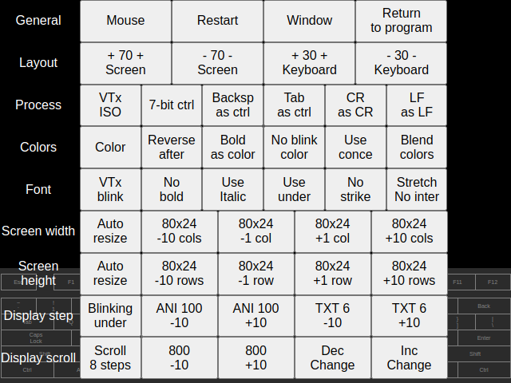

# Overview

In the **/files** subdirectory, there is the **\!\!config\.txt**, whis is TextPaint configuration file\. The file stores the default configuration, which can be changed using TextPaint editor\. The modified configuration file is stored in database\.

**TextPaint** can modify the file automatically when you use configuration functions, file manager and sometimes other options\.

**TextPaint** has two settings functions, which immediately modifies the **\!\!config\.txt** file and takes effect\.

# Settings panel

Everytime, if you click on the screen, the configuration panel will be shown\.

The panel consists of following button rows:

* **General** \- General actions:
  * **Mouse/Touchscreen** \- Toggle between mouse and touchscreen, this affects on the screen keyboard\.
  * **Restart** \- Restart the application by refresh the page or reset configuration\.
  * **Window/Fullscreen** \- Toggle display between window and fullscreen\.
  * **Return to program** \- Close the interface and return to the program\.
* **Layout** \- Set the screen and virtual keyboard sizes\. The value on the button indicatec current size percentage\.
* **Process** \- Toggle the ANSI processing options\. The button captions indicates the current state\. The change affects after processing new data\. In the player, you have to reopen the file\. In the terminal, the will be affect fo new data only\.
* **Colors** \- Set the color display options\. The button captions indicates the current state\. The result will be shown immediately and the affect the screen display only\.
* **Font** \- Set the font display options\. The button captions indicates the current state\. The result will be shown immediately and the affect the screen display only\.
* **Screen width** \- Change the screen width\. The values on the buttons indicates current resolution\. The **Auto resize/No resize** button sets the allow to automatic resize in terminal and animation player\.
* **Screen height** \- Change the screen height\. The values on the buttons indicates current resolution\. The **Auto resize/No resize** button sets the allow to automatic resize in terminal and animation player\.
* **Display step** \- Cursor style and display step in animation player:
  * **Cursor style** \- Changes the cursor style from one of 7 styles including hidden \(invisible\) cursor\.
  * **ANI** \- Displays and changes the step in characters in terminal and animation player within animation mode\.
  * **TXT** \- Displays and changes the step in text lines in animation player within text mode\.
* Display scroll \- Scroll settings:
  * **Scroll steps** \- Changes the number of steps per one text line\. This affects on the scroll smooth\.
  * **Steps** \- Changes the scroll speed in steps per one line\.
  * **Dec Change/Inc Change** \- Changes the value change amount in **Display step** and **Display scroll** rows\. The current change amount are visible in the value changing buttons\.

## Application restart or configuration reset

The **Restart** button has the following workflow:

* Display **Reset configuration** confirmation:
  * Click **Cancel** \- Display page refresh/leave confirmation \(text depends on browser\):
    * Confirm page refresh/leave \- **TextPaint** will be restarted\.
    * Discard page refresh/leave \- **TextPaint** will not be restarted\.
  * Click **OK** \- Display **Clear file storage** confirmation:
    * Click Cancel \- Remove **\!\!config\.txt** from storage\. You should restart the application by clicking the Restart button again\.
    * Click OK \- Remove all files from storage including **\!\!config\.txt** file\. You should restart the application\. You should restart the application by clicking the Restart button again\.

# Settings pop\-up

The settings pop\-up is the settings interface available by keyboard\. Most, but not all settings are the same as in settings panel\.

The pop\-up can be shown by following action:

* **Text editor** \- Press **F9** for show character/color selector pop\-up, then press **F4**\.
* **Animation player** \- Press **\\** \(backslash\) key during animation display\.
* **Terminal** \- Press defined escape key to display terminal pop\-up, then press **\\** \(backslash\) key\.
* **Keyboard test** \- Settings pop\-up is not available\.

The pop\-up has three states and during display, there are commonly available the following keys:

* **Enter** or **Escape** \- Close pop\-up and return to application\.
* **Insert** or **Delete** \- Switch to next state in 3\-state cycle\.
* **Tab** \- Change pop\-up location\.

In every state, there are available additional keys depending os state\. 

## State 1 \- Display settings

In this state, there are general display and data processing settings\.

Every setting is preceeded by letter, which indicates the key, wich changes the setting\. Additionally are available the following keys:

* **Left Arrow**, **Right Arrow**, **Up Arrow**, **Down Arrow** \- Change streen width or height by 1\.
* **Home**, **End**, **Page Up**, **Page Down** \- Change streen width or height by 10\.
* **Space** \- Enable/disable sutomatic resolution change by commands from data stream\.

## State 2 \- Color palette

This state displays current palette and allows to change current palette\.

Available keys:

* **Up Arrow**, **Down Arrow** \- Change the current palette\. The palette will be changed immediately\.

If there is currently displayed XBIN file with custom palette, the palette will be shown and you can change to the standard palette by pressing **Up Arrow** or **Down Arrow**\. Retur to custom palette without file reload or replay is not possible\.

## State 3 \- Screen font\.

This state displays available font list and allows for change the current font\.

Available keys:

* **Up Arrow**, **Down Arrow** \- Change the current palette\. The palette will be changed immediately\.
* **Left Arrow**, **Right Arrow** \- Change the duospace font mode:
  * **Monospace** \- Monospace without double\-width characters\.
  * **Duospace** \- Duospace font\.
  * **Dbl\-W** \- Monospace with double\-width characters and stretched single\-width characters\.

When you select the one\-page font consisting of 256 characters or you are displaying XBIN file with custom font, the character set will be displayed\. If you change the font or mode, the character set will not be displayed\. If you select the one\-page font and you want to see the character set, you have to repaint the pop\-up by pressing **Insert** or **Delete** or **Tab** key\.

If you play XBIN fine and custom font makes the interface unreadable, you can restore the readibility by font change via the sequence:

* Press **\\** key for settings pop\-up\.
* If the color palette \(all colors used in the screen\) is not visible, press the **Insert** or **Delete** key until you see the color palette\.
* Press **Insert** or **Delete** one more time to switch from state 2 to state 3\.
* Press **Up Arrow** or **Down Arrow** key to change screen font\.

## State 4 \- Display speed

The state displays and allow to set the display speed during terminal session or animation playback\.

Every setting is preceeded by letter, which indicates the key, wich changes the setting\.

# Configuration file contents

The lines without equation sign and blank lines are ignored and can be used for comments\. Any prefix is not required for treat this line as comment\.

You can change this file using editor \(you can also use the TextPaint for this\) and the changes will take effect after application restart or refresh\. The settings are splitted into categories, which are highlighted by \#\#\# prefix in the **\!\!config\.txt**\. Italicized parameters can be changed \(mostly indirectly\) during TextPaint session\. The action, which changes the settings is described as italic\.

Some parameters contains the ordinal number\. In this document, the number is presented as **?** character\.

## Application timer options

**TextPaint** uses the timer, which periodically updates display \(cursor and blink\) and invokes event depending on **TextPaint** state\. *All these parameters can be changed everytime in the settings panel or settings pop\-up\.*

* **TimerFrames** \- The number of display frames between tick, used in blinking cursor, blinking test, animation player and terminal\.
* ***TimerCursor*** \- Number of the ticks, which changes the cursor state between visible and invisible\. This value should be a divider of **TimerLoop** value\.
* **TimerBlink** \- Number of the ticks, which changes the blinking text state between normal and dimmed/invisible\. This value should be a divider of **TimerLoop** value\.
* **TimerTick** \- Number of the ticks, which invokes the timer event in TextPaint\. This is used mostly in animation player and terminal for sequentally text display\.
* ***TimerStep*** \- Number of characters per step in animation player and terminal session\.
* ***TimerStepText*** \- Number of lines per step in animation player within text mode\.
* ***TimerStepChange*** \- The change of ***TimerStep***, ***TimerStepText*** and ***ANSIScrollChars***, the value is from \-9 to 6 and represents the amounts:
  * **Negative value **\- Multiple or divide by the absolute value of the number increased by 1\. For instance, the **\-4** represents the multiply or divide by 5\.
  * **Zero** \- Increase or decrease by 1\.
  * **Positive value** \- Increase or decrease by number represented by 10 powered by the value\.

## WebApiServer WebSocket address

If you want to handle disk files or connect to any external command or net server, the WebApiServer is required\. The WebApiServer is available in this repository: [https://github\.com/andrzejlisek/WebApiServer](https://github.com/andrzejlisek/WebApiServer "https://github.com/andrzejlisek/WebApiServer")\.

* **WebSocket** \- WebApiServer URL address\.

## Window and screen option

There are the screen display parameters\. *All these parameters can be changed everytime in the settings panel or settings pop\-up\.*

* ***WinW*** \- Screen width in text cells\.
* ***WinH*** \- Screen height in text cells\.
* ***WinAuto*** \- Automated window resize according the ANSI/VTxxx codes, for instance change between 80 and 132 column display\.
* ***WinScreenSize*** \- Percent of the whole screen, which is used for the TextPaint screen\.
* ***WinKeyboardSize*** \- Percent of the whole screen, which is used for the on\-screen keyboard\.
* ***WinTouchScreen*** \- Use the touch events instead of click events\. Recommended for use on devices with touchscreen, like tsmartphones\.
* ***DisplayInterpolate*** \- Screen interpolation mode:
  * **0** \- Stretch without interpolation\.
  * **1** \- Stretch with interpolation\.
  * **2** \- No stretch\.
* ***DisplayBlink*** \- Text blink display:
  * **0** \- Steady text
  * **1** \- VTx style \- dimming colors\.
  * **2** \- DOS style \- disappearing text\.
* ***DisplayAttrib*** \- Text display attributes presented as value from 0 to 15\. The value is sum of weights:
  * **1** \- Bold\.
  * **2** \- Italic\.
  * **4** \- Underline\.
  * **8** \- Strikethrough\.
* ***DisplayCursor*** \- Cursor style as following:
  * **0** \- Hidden cursor\.
  * **1** \- Blinking underline\.
  * **2** \- Steady underline\.
  * **3** \- Blinking vertical bar\.
  * **4** \- Steady vertical bar\.
  * **5** \- Blinking filled box\.
  * **6** \- Steady filled box\.

## Player configuration

There are the parameters used in the animation player\.

* ***PlayerEnd*** \- Seek to end file after file open or change\. *Press the ****Home**** or ****End**** key twice during playback to change the parameter\.*
* **PlayerDelayFrame** \- The number of steps to wait to `1Bh [ 1; P1 V` escape sequence for the further file processing\.
* **PlayerSeek** \- The number of steps for save the screen state in the memory:
  * Greater value \- shorter time for file load, possible hangs and freezes during playback backward\.
  * Less value \- longer time for file load, more fluent during playback backward\.

## Terminal configuration

There are parameter used for the terminal function, including internal VTTEST\.

* **TerminalName** \- Terminal name sent to server, used in the **TELNET** connection type\.
* **TerminalType** \- Terminal type as following, affests the DA and DCS/DECSCL report answers:
  * **0** \- VT100
  * **1** \- VT102
  * **2** \- VT220
  * **3** \- VT320
  * **4** \- VT420
  * **5** \- VT520
* ***TerminalKeys*** \- The terminal special key configuration as 7 digits\. *The configuration can be changed in the terminal pop\-up and some of them will be changed automatically according special escape sequences\.* The digits are following:
  * Cursor/arrow keys
    * **0** \- **Normal** \- *The DECRST/DECCKM command changes to ****Normal****\.*
    * **1** \- **Application** \- *The DECSET/DECCKM command changes to ****Application****\.*
  * F1\-F4 keys
    * **0** \- **Normal**
    * **1** \- **Alternative**
  * F5\-F12 keys
    * **0** \- **Normal**
    * **1** \- **Alternative**
  * Editing keys
    * **0** \- **DEC** \- **Home** and **End** keys acts as **Find** and **Select** keys present in original DEC terminals\.
    * **1** \- **IBM N** \- **Home** and **End** keys emmits standard commands\.
    * **2** \- **IBM A** \- **Home** and **End** keys emmits alternative commands\.
  * Enter \(CR, CR\+lf, LF, cr\+LF\)
    * **0** \- **CR** \- *The RM/LNM command changes ****CR\+lf**** to ****CR****\.*
    * **1** \- **CR\+lf** \- *The SM/LNM command changes ****CR**** to ****CR\+lf****\.*
    * **2** \- **LF** \- *The RM/LNM command changes ****cl\+LF**** to ****LF****\.*
    * **3** \- **cr\+LF** \- *The SM/LNM command changes ****LF**** to ****cr\+LF****\.*
  * Backspace
    * **0** \- **DEL** \- Send 0x7F character \- *The DECRST/DECBKM command changes to ****DEL****\.*
    * **1** \- **BS** \- Send 0x08 character \- *The DECSET/DECBKM command changes to ****BS****\.*
  * Numpad
    * **0** \- **Normal** \- Send normal characters \- *The DECRST/DECNKM command changes to ****Normal****\.*
    * **1** \- **Application** \- Send special commands \(decimal point as dot and plus as comma\) \- *The DECSET/DECNKM command changes to ****Application****\.*
* **TerminalAnswerBack** \- The AnswerBack text sequence\.

## Terminal connections

There is the terminal connection list, which will be displayed and accessible at the teminal mode beginning\.

* **Terminal?Name** \- Conncetion name displayed on screen\.
* **Terminal?Type** \- Connection type as following:
  * **TELNET** \- Network connection using Telnet protocol\.
  * **RAWNET** \- Raw network connection\.
  * **CMD** \- Run system command and redirect standard streams \(input, output, error\)\.
* **Terminal?Addr** \- Network address with port number or command with parameters\.
* **Terminal?Codec** \- Text codec used in connection

## Bell options

There are the bell sound options\. The sound can be emitted in animation player and terminal modes\.

* **BellVolume** \- Sound volume from 0 \(silence\) to 100 \(maximum possible volume\)\.
* **BellFrequency** \- Sound frequencyin Hz\.
* **BellDuration** \- Sound duration in milliseconds\.

## File extensions for type detect

There are file extension options used in file manager and file opening\. The extension list should be written in lowercase, separated by comma\.

* **FileExtText** \- File with one of this this extensions will be treated as text file\.
* **FileExtAnsi** \- File with one of this this extensions will be treated as ANSI file\.
* **FileExtBin** \- File with one of this this extensions will be treated as binary \(screen raw\) file\.
* **FileExtXbin** \- File with one of this this extensions will be treated as XBIN file\.
* **FileExtOmmit** \- In animation player, files with this extensions will be skipped when you change file using Page Up or Page Down\.

## Common ANSI process settings

There are the ANSI file process settings used in all modes\. *Most of these parameters can be changed everytime in the settings panel or settings pop\-up\.*

* ***ANSIReadCR*** \- Treating the CR character in data:
  * **0** \- Read as CR\.
  * **1** \- Read as CR\+LF\.
  * **2** \- Ignore\.
* ***ANSIReadLF*** \- Treating the LR character in data:
  * **0** \- Read as LF\.
  * **1** \- Read as CR\+LF\.
  * **2** \- Ignore\.
* **ANSIWidth** \- Ansi virtual screen width, used only in text editor\. This parameter can be temporarily changed in character/color pop\-up\.
* **ANSIHeight** \- Ansi virtual screen height, used only in text editor\. This parameter can be temporarily changed in character/color pop\-up\.
* ***ANSIDOS*** \- Data processing mode:
  * **0** \- VTx mode with ASCII\+ISO character set at default \- use in most cases especially with UTF\-8 data\.
  * **1** \- DOS mode \- use with data designed for DOS ANSI\.SYS display\.
  * **2** \- VTx mode with ASCII\+DEC character set at default \- use with original DEC data, which displays incorrectly while ANSIDOS=0, due to relying on default character set\.
* ***ANSI8bit*** \- Treating the characters from 0x80 to 0x9F:
  * **0** \- As normal characters \- compatible with most ANSI files for DOS\.
  * **1** \- As control characters \- compatible with original VTx terminals for Telnet/SSH session with Unix, Linux and MacOS\.
* ***ANSIColors*** \- Use ANSI colors:
  * **0** \- Mono display ignoring color SGR\.
  * **1** \- Color display according color SGR\.
* ***ANSIReverseMode*** \- Text reverse display:
  * **0** \- No reverse \- ignore reverse attribute\.
  * **1** \- Before bold and blink \- compatible with most ANSI files for DOS\.
  * **2** \- After bold and blink \- compatible with original VTx terminals for Telnet/SSH session with Unix, Linux and MacOS\.
* ***ANSIColorBlink*** \- Background color for blink text:
  * **0** \- Blink attribute does not affect the background color\.
  * **1** \- Blink attribute changes the intensity of background color\.
* ***ANSIColorBold*** \- Foreground color for bold text:
  * **0** \- Bold attribute does not affect the foreground color\.
  * **1** \- Bold attribute changes the intensity of foreground color\.
* ***ANSIIgnoreConcealed*** \- The concealed attribute treatment:
  * **0** \- Ignore concealed attribute\.
  * **1** \- Hide concealed text\.
* ***ANSIPrintBackspace*** \- The backspace 0x08 character using:
  * **0** \- Use 0x08 as control character\.
  * **1** \- Use 0x08 as printable character\.
* ***ANSIPrintTab*** \- The backspace 0x09 character using:
  * **0** \- Use 0x09 as control character\.
  * **1** \- Use 0x09 as printable character\.
* **ANSIScrollChars** \- Number of characters, which smooth scroll durates\. Use 0 to turn off smooth scroll\.
* **ANSIScrollSmooth** \- Display smooth scroll when smooth scroll state is set\. This parameter may have following values:
  * **0** \- Do not use smooth scroll\.
  * **1** \- No text movement, delay only\.
  * **2** \- Move text by half of height\.
  * **3** \- Move text by quarter of height\.
  * **4** \- Move text by eighth of height\.

## Font settings

There are the font settings\. *The font can be changed in the settings pop\-up\.*

* ***FontMode*** \- Font display mode, affects only, when selected duo\-spaced font:
  * 0 \- Monospace without double\-width characters\.
  * 1 \- Duospace font\.
  * 2 \- Monospace with double\-width characters and stretched single\-width characters\.
* ***FontSelect*** \- Selected item from the font list\.

## Font list

The font list consists of available fonts, which are presented as bitmap files and eventually text file containing information about double\-width characters\.

* **Font?Name** \- Font name displayed in the font list\.
* **Font?File1** \- Primary font bitmap, required for every font\.
* **Font?File2** \- Optional font bitmap, containing double\-width characters\.
* **Font?File3** \- Optional text file containing the codes of double\-width characters\.

## Color blending options

Color blending options used for simulate solid color for some pattern character\. The color blending is not used while displaying XBIN file containing custom font\.

* ***ColorBlending*** \- Use color blending\.
* **ColorBlendingGamma** \- Display gamma value multiplied by 1000\.
* **ColorBlending\_?** \- Character color blending definition consisting of 5 values separated by comma:
  * Original character value\.
  * Replacement character value\.
  * Background component amount\.
  * Foreground component amount\.
  * Color replaced by blending color:
    * **0** \- Foreground color\.
    * **1** \- Background color\.

## Color palette

There are the color palette setting\. *The palette can be changed in the settings pop\-up\.*

* ***PaletteSelect*** \- Selected item from the palette list\.

## Color palette list

The palette list consists of available palettes\.

* **Palette?Name** \- Palette name displayed in the palette list\.
* **Palette?Colors** \- Palette colors consists of 192 hexadecimal numbers\. Each color is defined by 6 numbers\. The whole palette consists of 32 colors:
  * The first 16 colors is the ordinary 16 colors\.
  * The second 16 colors is used for display dimmed text while using VTx blinking\.

## Editor color configuration

There are the colors used in **TextPaint**\. Each value consists of tho hexadecimal digits\. The first is background, the second is foreground\.

* **ColorNormal** \- Color of default background and foreground in all work modes\.
* **ColorBeyondLine** \- Color of background indicating area beyond end of line, but not below the last line\.
* **ColorBeyondEnd** \- Color of background indicating area below the last line\.
* **ColorStatus** \- Color of status bar\.
* **ColorPopup** \- Color of pop\-ups\.
* **ColorKeyboard** \- Color of on\-screen keyboard\.
* **BeyondLineMargin** \- Number of columns, which will be displayed using **ColorNormal** instead of **ColorBeyondLine** regardless being beyond of the text line\. This setting may improve readibility of some ANSI files\. If you use negative value, there will be used the same value as **ANSIWidth**\.

## Editor character configuration

These parameters are used in text editor\. The character number are hexadecimal\.

* **Space** \- List of comma\-separated character numbers, which are treated as space\.
* **Frame1\_?** \- Definition of rectangle frame consisting of 12 elements:
  * Display name\.
  * Horizontal line character\.
  * Vertical line character\.
  * Upper left corner character\.
  * Upper tee character\.
  * Upper right corner character\.
  * Left tee character\.
  * Cross character\.
  * Right tee character\.
  * Lower left corner character\.
  * Lower tee character\.
  * Lower right corner character\.
* **Frame2\_?** \- Definition of diamond frame consisting of 12 elements, the layout is the same as rectangular, but rotated 45 degress clockwise:
  * Display name\.
  * Backslash\-shape line character\.
  * Slash\-shape line character\.
  * Upper corner character\.
  * Upper\-right tee character\.
  * Right corner character\.
  * Upper\-left tee character\.
  * Cross character\.
  * Lower\-right tee character\.
  * Left corner character\.
  * Lower\-left tee character\.
  * Lower corner character\.
* **PixelChar** \- Default characters used in pixel\-draw mode\.
* **Pixel\_?** \- Pixel character definition for pixel\-draw mode consisting of three elements:
  * Display name\.
  * Horizontal pixels per characters\.
  * Vertical pixels per characters\.
* **Pixel\_?\_0** \- Character list for pixel\-draw mode\. The character counts is the multiplication of horizonatal and vertical pixels per character\. For more readibility, the character list can be splitted for several parameters named **Pixel\_?\_1**, **Pixel\_?\_2** and so on\.

## Special ANSI configuration

There are additional, special configuration parameters for handle some files\.

* **ANSICharsDOS** \- List of 33 replacement character codes, to use as printable of characters from **00h** to **31h**, and **7Fh** while **ANSIDOS=1**\. This parameter is also used for reverse DOS char mapping while using single\-page font \(consisting of 256 characters only\)\.
* **ANSICharsVT52** \- List of 32 replacement character codes, to use as VT52 graphics characters from **5Fh** to **7Eh**\.
* **ANSIColorThresholdBlackWhite** \- Black and white color threshold used to convert from 256\-color or 24\-bit RGB into 6 colors\. The value can be between **0** \(not use black and white colors\) and **127** \(use black and white colors only\)\.
* **ANSIColorThresholdGray** \- Grayscale saturation threshold\. There is the maximum saturation, which is classified as gray color\. The value can be between **0** \(use gray only for unsaturated colors\) and **100** \(use gray colors for all colors brighter than black and darker than white\)\.

## File handling settings

There are the parameter used for file opening and reading\. *The parameters can be changed in file manager\.*

* ***FileCodec*** \- File codec number\.
* ***FileType*** \- File type:
  * **0** \- Autodetect, read unknown files as Text
  * **1** \- Autodetect, read unknown files as Text
  * **2** \- Text
  * **3** \- Ansi
  * **4** \- Bin
  * **5** \- XBIN

## Host fetch files

Files, which will be downloaded from **/files** subdirectory, when the file does not exist in storage\.

* **File?** \- File directory and name\.

## Favorite character table, you can store up to 256 characters

Favorite character set consisting of 256 characters, numbered from 0 to 255\. *This characters can be changed in character pop\-up in text editor\.*

* ***FavChar?*** \- Character number stored in the **?** position\.

