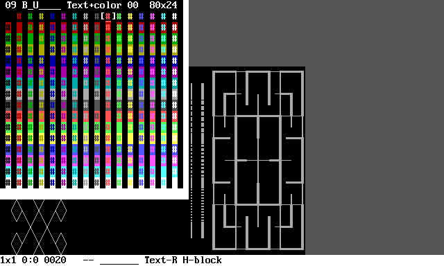

# Text editor

One of the main **TextPaint** features is text editor\. The editor differs from other plain\-text editors:


* Treats text file/screen as two\-dimensional plane divided into cells, where single cell consists of one character, two colors \(background and foreground\) and single attribute set\.
* Allows to draw primitive figures similarly as simple graphics applications\.
* Supports ASCII \(plain test\) and ANSI \(text with colors and attributes\) files\.

# Functionality and interface


**TextPaint** can work in one of the 4 states\. The default state is **state 1**\. In all states, you can use these keys:


* **Arrows** \- Move cursor horizontally or vertically\.
* **Home**, **End**, **Page Up**, **Page Down** \- Move cursor diagonally\.
* **Tab** \- Change cursor visualization type, one of four modes\. This function may help to match writing/drawing to other objects\.
* **F1** \- Switch to **state 1** \(write text\) or show information about **state 1**\.
* **F2** \- Switch to **state 2** \(write characters\) or show information about **state 2**\.
* **F3** \- Switch to **state 3** \(character paint\) or show information about **state 3**\.
* **F4** \- Switch to **state 4** \(pixel paint\) or show information about **state 4**\.
* **F6** \- Change text writing direction\.
* **F7** \- Save file\.
* **F8** \- Load file\.
* **F9** \- Open character and color selector\.
* **F10** \- Open file manager\.
* **F12** \- Exit to main menu\.
* **Z** \- Undo \(not works in **state 1** and **state 2**\)\.
* **X** \- Redo \(not works in **state 1** and **state 2**\)\.

To undo or redo editing text or characters \(**state 1** or **state 2**\), you can undo/redy by following procedure:


* Switch temporarily to **state 2** or **state 3**\.
* Press **Z** or **X** key to undo or redo\.
* Switch back to **state 1** or **state 2**\.

The other available keys depends on the current working state\. The unnecessary spaces and lines are automatically trimmed during editing\. You can write on the grey aread, then necessary lines or spaces will be added automatically\.

The colors are following:


* **White text on black background** \- Actual text\.
* **Dark gray** \- Space beyond end of line\.
* **Bright gray** \- Space below the last line\.
* **Black text in white background** \- Status bar\.

## Context information

When you press the **F1**, **F2**, **F3**, **F4** key one more time, after switchint to the state, there will be displayed short information about selected state\. Use arrow keys to scroll the text\.


To close information, press **Esc** or any **F** key \(**F1**\-**F12**\)\.

## Status bar

At the bottom of console window, there is the status bar, with black text on white background\. The status bar in **state 1**, **state 2** and **state 3** has the following informations from left to right:


* Font and cursor size \(width and height\)\.
* Cursor position \(row and column\)\. The character between numbers indicated current text area:
  * **Colon** \- All cells of the cursor are inside some text line\.
  * **Semicolon** \- At least one cursor cell is beyond end of text line, but all cursor cells are not below the last line\.
  * **Comma** \- At least one cell of the cursor is below the last line of text\.
* Character number and glyph under the most cursor cells\.
* Number of background and foreground color under the most cursor cells, the hyphen indicates, that color is not defined \(used default\)\.
* Attribute state as 7\-character string under the most cursor cells, where underscore means disabled attribute and letter means enabled attribute as following:
  * **B** \- Bold\.
  * **I** \- Italic\.
  * **U** \- Underscore\.
  * **S** \- Strikethrough\.
  * **K** \- Blink\.
  * **R** \- Reserved\.
  * **C** \- Concealed\.
* State indicator:
  * **Text** \- Write text \(**state 1**\), followed by direction indicator:
    * **R \- Right** \- From left to right\.
    * **RD \- Right/Down** \- From up\-left to down\-right\.
    * **D \- Down** \- From up to down\.
    * **DL \- Down/Left** \- From up\-right to down\-left\.
    * **L \- Left** \- From right to left\.
    * **LU \- Left/Up** \- From down\-right to up\-left\.
    * **U \- Up** \- From down to up\.
    * **UR \- Up/Right** \- From down\-left to up\-right\.
  * **Char** \- Write character \(**state 2**\), followed by direction indicator the same as in the **state 1**\.
  * **Rect** \- Character drawing \(**state 3**\), rectangle shape\.
  * **Dia** \- Character drawing \(**state 3**\), diamond shape\.
* Elements in **state 3** only:
  * Shape size\.
  * Character code/glyph or character set name used to draw figure\.
* Insert/delete mode:
  * **H\-block** \- Insert or delete text inside one line, at right from the cursor \- moves text horizontally\.
  * **V\-block** \- Insert or delete text inside one column, below the cursor \- moves text vertically\.
  * **H\-line** \- Insert or delete columns \- moves text horizontally\.
  * **V\-line** \- Insert or delete rows \- moves text vertically\.
  * **H\-roll** \- Roll the text horizontally \- combine of insertion and deletion by font width, works in the **state 3** only and when the rectangle width is greater than 1\.
  * **V\-roll** \- Roll the text vertically \- combine of insertion and deletion by font height, works in the **state 3** only and when the rectangle height is greater than 1\.

The status bar in **state 4** has different layout, which is described in subchapter about **state 4**\.

# Character and color selector

**TextPaint** has two similar selectors\. In order to enter into selector, press **F9** key and switch between selectors by pressing **F3** key\.

## Character selector

In the **state 3** and **state 4**, you can draw using selected character\. The current drawing character and character code is shown on the status bar when the character is used to draw\. In the **state 1**, **state 2** and **state 3**, if you insert space \(in mode **H\-block** and **V\-block** only\), the selected character will be inserted\. You can invoke the character selector in every state by pressing the **F9** key\.


At the top of character table there will be display the character hexadecimal code and character glyph\. The code consists of 4 or 5 digits\. The plane 16 forces code length to be 6 digits, but is used very rarely, so the two leading digits for plane 16 is replaced by **G** for get 5\-digital code\. The **G** digit is outside of hexadecimal digit set and means 16\. For example, the **G1234** has the same meaning as **101234**\.

The character selector can work in two states:


* **Ordinary** \- Browse all characters\. By default, browsing the pages is limited for containing visible characters, but the limit can be enabled and disabled by pressing **Backspace** key\.
* **Favorite** \- The 256 places of favorite characters, 95 of them can be assigned to alphanumeric keys\.

You can use the following keys while the character table is shown:


* **Arrows** \- Select character on the current page\. You can go beyond the current page range to switch the page\.
* **Page Up**, **Page Down** \- Flip one page up or down \(go ahead 256 characters\)\.
* **Home**, **End** \- Flip 16 pages up or down \(go ahead 4096 characters\)\.
* **F1**, **F2** \- Switch the plane \(go ahead 65536 characters\)\.
* **F3** \- Switch to color selector\.
* **F4** \- Open the ANSI process and display parameters\.
* **Insert** \- Switch between ordinary and favorite state:
  * **Ordinary**: If the pinted character exists in favorite set, there will be pointed\.
  * **Favorite**: There will be pointed the same character, which is pointed in favorite state\.
* **Delete** \- Go to character being under the cursor\.
* **Backspace**:
  * **Ordinary**: Select character for save as favorite\.
  * **Favorite**: Select character or put character on pointed place\.
* **Tab** \- Move character selector window from corner to corner\. You can use this if the window covers some text or window is bigger than screen\.
* **Escape** \- Close without changing selected character\.
* **Enter** \- Change selected character and close\.
* **Any alphanumeric key**:
  * **Ordinary**: Save pointed character as favorite under pressed key\.
  * **Favorite**: Go to place assigned with pressed key\.

## Color selector

You can turn character selector into color selector or turn color selector into character chelector by pressing **F3**\. In color selector, you can select the color and input text mode\. The text and colors are treated as two independed layers, which can be modifed simultaneously or separately\.



While the color selector is showm, you can use the following keys:


* **Up arrow**, **Down arrow** \- Select background color\.
* **Left arrow**, **Right arrow** \- Select foreground color\.
* **Page up**, **Page down** \- Number of columns for ANSI file load\. Use if file is loaded incorrectly, applicable when file is loaded as ANSI\. Value 0 means automatic and will be updated after file load\.
* **Home**, **End** \- Number of rows for ANSI file load\. Use if file is loaded incorrectly, applicable when file is loaded as ANSI\. Value 0 means automatic and will be updated after file load\.
* **F1** \- Switch between CR character processing while loading ANSI file:
  * **0** \- Treat as CR character \(default\)\.
  * **1** \- Treat as CR\+LF sequence\.
  * **2** \- Ignore CR character\.
* **F2** \- Switch between LF character processing while loading ANSI file:
  * **0** \- Treat as LF character \(default\)\.
  * **1** \- Treat as CR\+LF sequence\.
  * **2** \- Ignore LF character\.
* **F3** \- Switch to character selector\.
* **F4** \- Open the ANSI process and display parameters\.
* **Insert** \- Switch between edit mode within three states:
  * **Text\+color** \- Edit text and color simultaneously\.
  * **Text** \- Edit text only without color changing\.
  * **Color** \- Edit color only without text changing\.
* **Delete** \- Go to color and retrieve attributes being under the cursor\.
* **Tab** \- Move color selector window from corner to corner\. You can use this if the window covers some text or window is bigger than screen\.
* **Escape** \- Close without changing selected color\.
* **Enter** \- Change selected color and close\.
* **Digit keys** \- Toggle attributes as following:
  * **1** \- Bold\.
  * **2** \- Italic\.
  * **3** \- Underline\.
  * **4** \- Strikethrough\.
  * **5** \- Blink\.
  * **6** \- Reserved\.
  * **7** \- Concealed\.

You can change text without changing colors or colors without changing the text\. In order to do, switch to appropriate mode using **Insert** key\. The text and colors are independed layes\. Actually, the attributes are in the color layer and may be treated as specific colors, other from background and foreground\.

## ANSI file loading

Many ANSI files are prepared for specified number of columns, in most cases for 80 columns and 24/25 rows with saving screen scroll\. If you set other number of columns, the file may be loaded incorrectly\. To correct this, enter into color selector, change number of columns or rows using **Page up**, **Page down**, **Home** or **End** keys and press Enter key\. Then, you have to reload file using **F8** key\.

If the ANSI file loaded is actually plain text file, the file can contain different end\-of\-line character than expected\. If the file is loaded incorrectly, you can change parsing of CR \(**0Dh**\) and LF \(**0Ah**\) character in color selector\. You can press **F1** or **F2** during color selector to change way of the character processing, the current state is diaplayed as two digits on the top of character selector\.

Example settings:


* **00** \- Standard process of CR and LF characters, suitable for all ANSI files and text files using CR\+LF like files created in DOS and Windows\.
* **21** \- Use LF character as CR\+LF \(EOL\), suitable for plain text files created on Unix and Linux, which uses LF as EOL\.
* **12** \- Use CR character as CR\+LF \(EOL\), suitable for plain text files created on systems, which uses CR as EOL\.
* **11** \- Use every CR character and every LF character as EOL separately\.

# Work states

The text editor works in one of 4 states, which you can swich by pressing **F1**, **F2**, **F3**, or **F4** key\. In order to display help text about keys available in the current state, press the same function key again\. For example, in order to get help about **state 2**, press **F2** while application works in **state 2**\.

## State 1 \- Write text

In the **state 1**, you can input alphanumeric characters like in every standard text editor, but there are few differences\.

You can use the following functional keys:


* **Escape** \- Change writing direction\.
* **Backspace** \- Move cursor in opposite direction \(this not delete the char\)\.
* **Insert** \- Insert line or character\.
* **Delete** \- Delete line or character\.
* **Enter** \- Change Insert/Delete mode\.

### Undo and redo

You can undo or redo writing, but the direct function not exists\. To undo or redo, you have to switch to **state 3** or **state 4** by pressing **F3** or **F4**\. Then, you can undo or redo by pressing **Z** or **X**\. After undo or redo, you can return to **state 1** by pressing **F1**\.

### Insert and delete

The **Enter**, **Insert** and **Delete** keys has different function than standard text editor\.

By pressing **Enter**, you can choose between four insert/delete modes:


* **H\-block** \- Insert or delete text inside one line, at right from the cursor \- moves text horizontally\.
* **V\-block** \- Insert or delete text inside one column, below the cursor \- moves text vertically\.
* **H\-line** \- Insert or delete columns \- moves text horizontally\.
* **V\-line** \- Insert or delete rows \- moves text vertically\.
* **H\-roll** \- Roll the text horizontally \- combine of insertion and deletion by font width, works on the **state 3** only and when the rectangle width is greater than **1**\.
* **V\-roll** \- Roll the text vertically \- combine of insertion and deletion by font height, works on the **state 3** only and when the rectangle height is greater than **1**\.

## State 2 \- Write characters

**State 2** works exactly by the same way as **state 1** with one difference: If you press alphanumeric key, there will be written favorite characters assignet to the keys instead of ordinary characters\. You can view and change the assigment in character selector\.


The state is most usable when you frequently write specified characters, because you can write the character just by pressing assigned key\.

## State 3 \- Character drawing

**State 3** is intended to the following actions:


* Draw line using frame characters\.
* Undo and redo\.
* Draw the rectangle or diamond on the selected place without painting line manually\.
* Copy and paste text\.
* Manually write frame elements\.
* Insert or delete larger portion of spaces\.
* Change font size\.


In the **state 3**, you have the following functions available:


* **W**,**S**,**A**,**D** \- Change figure size\.
* **Q**,**E** \- Change cursor position within the rectangle or diamond\.
* **Q** \- Move counter clockwise\.
* **E** \- Move clockwise\.
* **1** \- Change figure shape one of 9 possible shapes\.
* **2** \- Change character set\.
* **3** \- Draw hollow frame\.
* **4** \- Draw filled frame\.
* **5** \- Start or stop drawing line by moving cursor\.
* **6**,**7** \- Font width\.
* **8**,**9** \- Font height\.
* **C** \- Copy the text being inside the figure\.
* **V** \- Paste the text into the area inside the figure\.
* **Insert** \- Insert line or character \(works on rectangle shape only\)\.
* **Delete** \- Delete line or character \(works on rectangle shape only\)\.
* **Enter** \- Change Insert/Delete mode\.
* **I** or **Numpad Plus** \- Write vertical line\.
* **K** or **Numpad Minus** \- Write horizontal line\.
* **Space** or **Numpad 0** \- Write selected character\.

### Writing frame elements

Apart from keys listed above, you can write frame elements \(corners, tees and crosses\) using some letter keys and numpad digits as in the following scheme:

```
  T---Y---U         T         7---8---9         7
  |   |   |        / \        |   |   |        / \
  |   |   |       G   Y       |   |   |       4   8
  |   |   |      / \ / \      |   |   |      / \ / \
  G---H---J     B   H   U     4---5---6     1   5   9
  |   |   |      \ / \ /      |   |   |      \ / \ /
  |   |   |       N   J       |   |   |       2   6
  |   |   |        \ /        |   |   |        \ /
  B---N---M         M         1---2---3         3
```

For example, the **T** key or **Numpad 7** writes the upper left corner as shown above\. The diamond shape is treated as rectangle rotated clockwise by 45 degrees\.

### Insert and delete

The insert and delete function works by the same way as in **state 1** and **state 2**, but there is few differences:


* This function works only, when rectangle shape is selected\.
* In **H\-block** and **H\-line** modes, the rectangle width determines number of inserted or deleted columns once\.
* In **V\-block** and **V\-line** modes, the rectangle height determines number of inserted or deleted columns once\.
* In **H\-block** mode, there can be modified few rows according to rectangle height\.
* In **V\-block** mode, there can be modified few columns according to rectangle width\.
* The **H\-roll** and **V\-roll** modes works in the **state 3** only and while the rectangle width \(for **H\-roll**\) or the rectangle height \(for **V\-roll**\) is greater then **1**\.

### Font size

**State 3** is the only state, which allows to change font and cursor size, which will be applied for all states\. The font width and height can be adjusted separately, between 1 and 32 cells\. The cursor size represents the current font size and the size is indicated on the status bar\. The move step is the same as current font width or height\. To move cursor over another distance, change the font size\.

If you change font size whice the cursor is not at the first line and the first column, it is possible, it is possible, that the cursor distance from begining does not equal to multiply font width or height\. In such case, when you move the cursor left or up, the first column or the first row will not reachable, because the remaining distance is less than font size\. Cursor position above the first row or before the first column is not possible\.

While the font width or height is greater than **1**, the current character or color indicated on the status bar and used in some operation is determined be the most number of cells containing such character or color\. If there are several characters in the same number of cells within the cursor, the first occurence will be used\.

You can copy and paste the text preserving the font size only when the font size is **1x1** while both copying and pasting\. When you copy or paste with other font size, the text and color will be preserved\. Otherwise, you can copy the text written with the bigger font into the other software or paste the text from the other software using desired font size\.

## State 4 \- Pixel drawing

The **state 4** is purposed to draw pictures using semigraphical characters splitted into pixels\. Some characters offers pixels by splitting for example to **2x2** pixels per character\. You can paint by character or by pixels as defined in configuration file\. In the state, there are two cursors:


* **Main cursor** \- The cursor, which is moved by **Arrow** keys and **Home**/**End**/**PageUp**/**PageDown** keys\. Pressing these keys causes movement of both cursors\.
* **Size cursor** \- The second cursor, which is connected with main cursor\. This cursor determines figure size for drawing lines, rectangles, ellipses, and copying/pasting picture\.


During **state 4**, there are following functions by keys:


* **W**,**S**,**A**,**D** \- Move size cursor\.
* **I**,**K**,**J**,**L** \- Move picture between cursors\.
* **1** \- Change paint configuration:
  * The first configuration uses one pixel per character and allows to select character for foreground and background in character selector\.
  * The other configurations may use several pixels per character\. Every pixel configuration inside character is mapped to appropriate character\.
* **2** \- Change default color\. This option defines, how will be treated characters other than characters used in current paint configuration\.
* **3** \- Draw one pixel \(in hollow mode\) or flood fill \(in fill mode\)\.
* **4** \- Draw line between cursors\.
* **5** \- Draw rectangle between cursors\.
* **6** \- Draw ellipse between cursors\.
* **P** \- Turn pencil on/off\.
* **M** \- Change picture move mode\. The mode is used while moving using **I**,**K**,**J**,**L** keys:
  * **Repeat** \- The edge of moved picture will be repeated\.
  * **Roll** \- The edge will be fillled with edge from the other side of moved picture\.
  * **Background** \- The edge will be filled with background color\.
  * **Foreground** \- The edge will be filled with foreground color\.
  * **Flip/Rotate** \- Flip or rotate instead of movement\. Use keys as following:
    * **I** \- Flip vertically\.
    * **K** \- Flip horizontally\.
    * **J** \- Rotate counter clockwise \- works only when width equals to height\.
    * **L** \- Rotate clockwise \- works only when width equals to height\.
* **N** \- Invert colors between cursors\.
* **C** \- Copy picture between cursors as text to clipboard\. This function uses characters selected as foreground and background color in first paint configuration\.
* **V** \- Paste picture between cursors from flipboard\. The clipboard bust contain text using characters selected as foreground and background color in first paint configuration\.
* **Q**,**E** \- Move cursors around rectangle corners determined by this cursors:
  * **Q** \- Move counter clockwise\.
  * **E** \- Move clockwise\.
* **R** \- Change paint color wrom there options:
  * **Background** \- Use background color\.
  * **Foreground** \- Use foreground color\.
  * **Negative** \- Changes to opposite color while drawing\.
* **F** \- Change paint fill option for drawing pixels, rectangles and ellipses:
  * **Hollow** \- Draw pixels and hollow figures\.
  * **Fill** \- Draw floodfill and filled figures\.

### Status bar

In state 4, the status bar has different layout, described from left to right:


* Font and cursor size \(width and height\)\.
* Canvas cursor position and size in pixels\. The size sign \(plus or minus\) indicates direction from main cursor to size cursor\.
* The **state 4** indicator with default color and pencil state:
  * **Pxl\-B** \- The default color is background, pencil is off\.
  * **Pxl\-F** \- The default color is foreground, pencil is off\.
  * **Pxl\-B\*** \- The default color is background, pencil is on\.
  * **Pxl\-F\*** \- The default color is foreground, pencil is on\.
* The paint configuration:
  * The first configuration \(one pixel per character\) is indicated by codes of used characters, separated by slash\.
  * The other configurations are indicated by configuration name\.
* Drawing color and fill mode:
  * **Fore\-H** \- Foreground color, hollow\.
  * **Back\-H** \- Background color, hollow\.
  * **Nega\-H** \- Negative color, hollow\.
  * **Fore\-F** \- Foreground color, fill\.
  * **Back\-F** \- Background color, fill\.
  * **Nega\-F** \- Negative color, fill\.
* Picture move mode:
  * **Repeat** \- The edge of moved picture will be repeated\.
  * **Roll** \- The edge will be fillled with edge from the other side of moved picture\.
  * **Back** \- The edge will be filled with background color\.
  * **Fore** \- The edge will be filled with foreground color\.
  * **FlipRot** \- Flip or rotate instead of movement\.

### Cursor display

Console can display cursor over the character, not over the pixel\. If you select configuration with pixels smaller than character, you will move pixel by pixel, when you press cursor keys\. The visible cursor will by over this character, which contains pointed pixel\. To point a specified pixel, you have to observe the position on status bar or count movement from last visible cursor movement\.

To check position, you can draw pixel or other figure \(key **3**, **4**, **5**, **6**\) and undo the drawing by pressing **Z**\.


