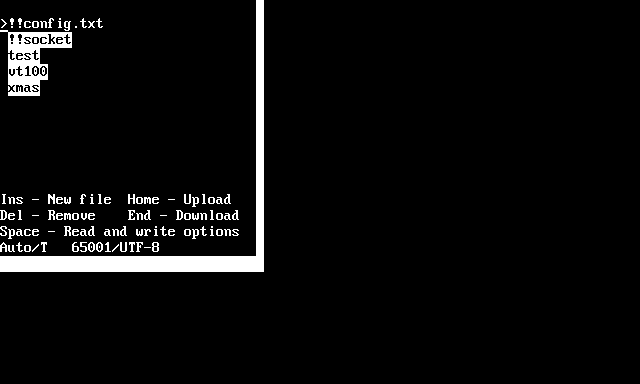
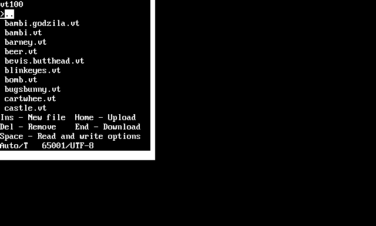
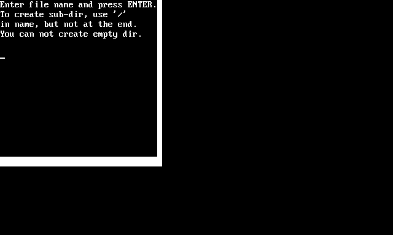
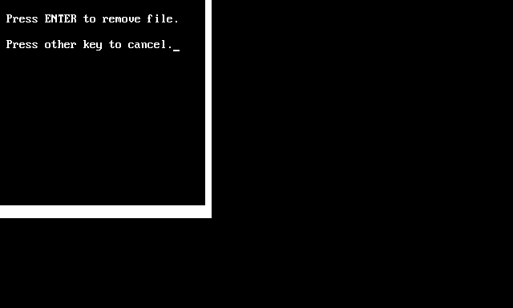
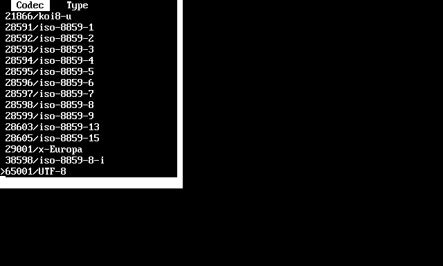
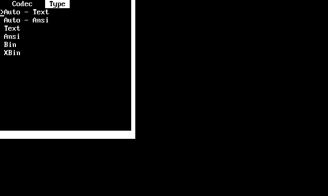

# File manager

This **TextPaint** has the internal file manager, which now allows to browse the files from internal storage and external storage via WebSocketApi\.

The file manager is available int these modules:

* **Text editor** \- Press **F10** key\.
* **Animation player** \- There are two ways:
  * **Information screen** \- Press **Enter** key\.
  * **Animation playback** \- Press the **\.** \(dot/period\) key\.

The file magager is the pop\-up window, where directories are highlighted by color inverse\.

In the file manager, there are special items, which are always visible\.

* **\!\!config\.txt** \- configuration file\.
* **\!\!socket** \- WebApi socket, which accesses to disk files via [https://github\.com/andrzejlisek/WebApiServer](https://github.com/andrzejlisek/WebApiServer "https://github.com/andrzejlisek/WebApiServer")\.

The **\!\!** is for enforce positioning special item at the list begin\.

In the file manager, there are posiible the following keys:

* **Tab** \- Move the popup\.
* **Up arrow** and **Down arrow** \- select item\.
* **Enter** \- Exit from the file manager when selected file or enter into directory or upper directory\. The file selectrion has the following effect:
  * **Text editor** \- You have to press the **F8** to load selected file or press the **F7** key to save the current text into the selected file\.
  * **Animation player** \- The file manager is needed for change the current directory\. After closing the file manager, the selected animation will be loaded\.
* **Escape** or **Backspace** \- Exit from the file manager without changing selected file\.
* **Insert** \- Add new blank file\. If you want to add new direcotry, use shach charecter in name, for example **dirname/file**\. The empty directory is not allowed\.
* **Delete** \- Remove file or directory\.
* **Home** \- Upload files\. The ZIP files will be extracted\.
* **End** \- Download file or directory\. The directory will be downloaded as single ZIP file\.
* **Space** \- Read and write options \(codec and file type\)\.

In the directory other than root directory, the path is be shown at the top and on file list, there is the **\.\.** imaginary directory, which gives the access to upper directory\.

# File operations

The file manager allows for some file operations by appropriate keys listed in previous chapter\.

## New blank file

If you press the **Insert** key, you can add new blank file, which will be created within the current directory\.

You have to write the new file name\. If you want to create subdirectory, input the name containing the **/** \(slash\) character, for example **dirname/filename**\. You can not create directory without creating file\.

You can not add file within **\!\!socket** directory or its subdirectories\.

## Remove file

If you press the **Delete** key, you will be asket to confirm file or directory removement\.

Press enter to remove selected file\.

You can not remove files and directories within **\!\!socket** directory or its subdirectories\.

## Upload and download files

To upload files, press the **Home** key\. The standard file open dialog will be shown and you can select one or several files to upload into the internal storage\. If you select any ZIP file, the archive contents will be extracted\.

To download file or directory, press the **End** key\. The standard file save dialog will be shown and you have to set the file number, which will be saved from internal storage\. If you download the directory, the contents will be packet into single ZIP archive file\.

While upload/download procesing, there will be shown two numbers\. The first number is number of currently processed file, the second number is quantity of all files\.

If you upload ZIP archive files, the quantity of all files will be increased by number of files within ZIP archive\.

# Text codec

You can change the text codec used for file load or save\. To do this, you have to press **Space** key, select **Codec** by **Left Arrow** or **Right Arrow**\.

Using the **Up Arrow** or **Down Arrow**, select the text codec, then press **Space** key again\.

# File type

You can change the file type for file load or save\. To do this, you have to press **Space** key, select **Codec** by **Left Arrow** or **Right Arrow**\.

Using the **Up Arrow** or **Down Arrow**, select the text codec, then press **Space** key again\.

The options has the following meaning:

* **Auto \- Text** \- Apply file type depending on extension according parameters in **\!\!config\.txt**, treat file with unknown extension as **Text** file\. If you load **Bin** or **XBin** file into text editor and save file, the file will be saved as **Ansi** file\.
* **Auto \- Ansi** \- Apply file type depending on extension according parameters in **\!\!config\.txt**, treat file with unknown extension as **Ansi** file\. If you load **Bin** or **XBin** file into text editor and save file, the file will be saved as **Ansi** file\.
* **Text** \- Treat every file as **Text** file regardless the file extension\.
* **Ansi** \- Treat every file as **Ansi** file regardless the file extension\.
* **Bin** \- Load every file as **Bin** file regardless the file extension and save any edited file as **Ansi** file\.
* **XBin** \- Load every file as **XBin** file regardless the file extension and save any edited file as **Ansi** file\.

