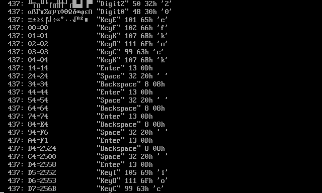

# Keyboard test and encoding list

The keyboard test has three pusposes:

* Get list of all supported encodings usen in file read/write and terminal connections\.
* Display characters of any 8\-bit encoding\.
* Keyboard input test through displaying key name and character\.

Afer running this module, you have press various keys\. After every pressing key, there will be displayed one item of encoding list and name/character of pressed key\. If you press the same key 5 times, **TextPaint** will return to main menu\.

# Encoding list

In encoding display context, there are three key sets on the keyboard\. pressing any of key from the same key sets, the action will be the same\. The keyboard sets are following:

* **Set 1** \- **Escape**, **\`**, **~**, **Tab**\.
* **Set 2** \- **Backspace**, **Enter**, **Space**\.
* **Set 3** \- Any key, which not belongs to **Set 1** or **Set 2**\.

The \.NET Framework supports about 100 character encodings, the number varies depending on operating system and \.NET/Mono version\. If you press any key from **Set 3** first fime, there will be displayed encodigs, which are set as parameters\. If the provided custom 8\-bit encoding, the **FILE** word will be displayed\. After parameter, the word **Items** and actual number of supported encodings will be displayed\. Then, if you press keys from **Set 3** one more times, there will be displayed items\. After last item, there will be displayed blank line and the encoding list will be repeated\.

Each encoding list item consists of codepage number followed by colon and optional encoding names separated by comma\. Every encoding name does not contain spaces\. In **Config\.txt** file or command line parameter you can use either code page number or encoding name\.

If you press any key from **Set 1**, the encoding list will be iterated backward, also will be looped\.

If last displayed encoding is 8\-bit encoding, you can display character set by pressing any key from **Set 2**\. If last displayed encoding is not 8\-bit encoding or last displayed information is not encoding, pressing any key from **Set 2**, you will get the same result as pressing any key from **Set 3**, so you will be iterated to next item\.

While you display the character set, the action of keys will be following:

* **Set 1** \- Return to encoding list\.
* **Set 2** \- Iterate ofer 16 items \(skip 15 items\)\.
* **Set 3** \- Iterate over 1 item\.

The character set and character list will are displayed infinitely until you press any key from **Set 1**\. In this state, if you press the same key five timer, you will quit from application\.

# Keyboard input test

After pressing any key, there will be displayed informations about pressed key:

* Key name in quotes\.
* Character number in decimal format\.
* Character number in hexadecimal format\.
* Character in apostrophes when the character is printable\.
* Key modifiers, displayed when key is pressed with **Shift** or **Ctrl** or **Alt**\.

The key names and character numbers are JavaScript standard names and can be used in developing other JavaScript/WebAssembly applications running in web browser\.

