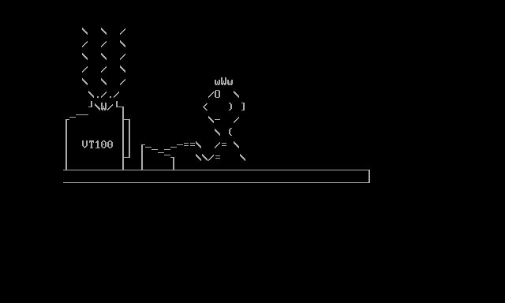

# Animation player

**TextPaint** can handle ANSI escape codes, which allows to get colored text using colors from palette of standard 16 items, which was used in DOS operating system and ANSI\-compatible text terminals like DEC VT100\. In 1990s the ANSI files was popular format of colorful ASCII\-art, which was called as ANSI\-art\.

Some ANSI files contains simple animation achieved by manipulating cursor position and character writing out of the line\-by\-line order\. Such files was animated where was displayed slowly\. Most BBS and similar services provides about 2400 bits per second\.

The animation player allows to display any file using sequentially displaying character to view simple ANSI animations or graphics like while downoading in real time\. After running the animation player, you will see information about functions available during displaying\. At this state, you have two choices:

* Press **Enter** key for select the file from file manager\.
* Press **Tab** key for return to main menu\.

You can play the animation forward, backward or seek manually by pressing appropiate keys\.

You can use the following keys while animation display:

* **Escape** or **=** \- Return to information screen\.
* **Tab** \- Show or hide status bar\.
* **\`** \- Change information displayed on the status bar\.
* **Space** \- Show the file information including SAUCE\. For return to player, you have to press one of the following keys: **Space**, **Escape**, **Enter**, **Backspace**\.
* **Enter** \- Start or stop playing forward, according the FileDelaySteps and FileDelayTime parameters\.
* **Backspace** \- Start or stop playing backward, according the FileDelaySteps and FileDelayTime parameters\.
* **Up Arrow** and **Down Arrow** \- Move animation position by one character \(animation mode\) or one line \(text mode\)\.
* **Left Arrow** and **Right Arrow** \- Move animation position by steps defined as **TimerStep** or **TimerStepText**\.
* **Home** \- Move into animation begin\.
* **End** \- Move into animation end\.
* **\\** \- Switch into animation mode\.
* **\[** \- Switch into text mode before scroll\.
* **\]** \- Switch into text mode after scroll\.
* **Page Up** or **Page Down** \- Browse for previous or next file\.
* **,** \- Copy screen to clipboard\.
* **\.** \- Display file manager\.
* **/** \- ANSI processing parameters and display configuration\.

In order to exit to main menu, press the **Escape** key or **equation sign** key to return to information and press **Tab** key to exit\.

# Mouse operation

During animation display, you can use mouse for copy any screen area into clipboard\. The area will be rectangular between mouse button press and release\. The area will not be highlighted\.

# Status bar

During display, you can show or hide the status bar by pressing **Tab** key, Using the the **\`** or **~** key you can switch between the five states\.

* **State 1** \(default\) \- Basic information about file and playback:
  * Position step and animation length\.
  * Four elements for help to distinguish animation and still image:
    * Number of written characters\.
    * Number of overwritten characters\.
    * Number of insert/delete operations\.
    * Number of scroll operations\.
  * Current display mode:
    * **ANI** \- Animation mode
    * **TXB** \- Text mode before scroll\.
    * **TXA** \- Text mode after scroll\.
  * Current index number and number of all files followed by current file name\. You can switch between files using **Page Up** and **Page Down** keys\. The character separating the index number and file name has the following meaning:
    * **Colon sign** \- The file does not contain the SAUCE information\.
    * **Equation sign** \- The file contains the SAUCE information, which can be shown by pressing the **Space** key\.
  * Current speed change, 0 means default speed defined as FileDelayStep parameter\. You can change the speed usin \+ and \- keys\. Alternatively, you can use the = and \_ keys\.
* **State 2** \- Animation details:
  * Position step and animation length\.
  * Four elements for help to distinguish animation and still image:
    * Number of written characters\.
    * Number of overwritten characters\.
    * Number of insert/delete operations\.
    * Number of scroll operations\.
  * Current display mode:
    * **ANI** \- Animation mode
    * **TXB** \- Text mode before scroll\.
    * **TXA** \- Text mode after scroll\.
  * Current animation speed as number of playback steps\.
  * Number of current step and minimum/maximum number of dummy steps added by **1Bh \[ 1 ; P1 V** \(time marker\) sequence\. The negative number means, that the time presented by time marker represents ealier number of steps\. In such case, the display can be slightly glitched\. You have to increase the **PlayerDelayFrame** parameter to solve this problem\. If the time marker is not processed, there will be displayes two question marks\.
* **State 3**, **State 4** and **State 5** \- the states allows to follow the character processing during playback:
  * Position step and animation length\.
  * Current character and animation character number \(may vary depending on used codec\)\.
  * Several characters before and after current playback position, in this information there is difference between the three states:
    * **State 3** \- Display characters above **0x1Fh** as characters and below **0x20h** as numbers\.
    * **State 4** \- Display characters from **0x21h** to **0x7E** as characters and other characters as numbers\.
    * **State 5** \- Display all characters as numbers\.

Every press Tab key forces screen to repaint, so if screens displays glitches, press the **Tab** or **\`** or **~** key to repaint\.

Status bar at the top, screen height is expanded by one row\.

Status bar at the bottom, screen height is expanded by one row\.

# Still picture, text and animation

The most ANSI files can be classified into three categories:

* Still picture, which size is in the screen size \(usually 80x24 or 80x25\)\.
* Still picture or text, which size exceedes the screen size vertically \(at the end of play, the bottom part is visible\)\.
* Animation created using ANSI/VTxxx commands\.

There is no way to distinguisg there types, but animation player counts some operations, which allows to suppose \(but without sure\), what is the file kind:

* **Character writes** \- All characters writes during animation playback\.
* **Character overwrites** \- Occurs very frequently in animations, but rather not occurs in still pictures\. The character write will be classified as overwrite, where meets at least one of following conditions when comparing to previous character in the same place \(the font attribues such as bold or underline are treated as foreground color\):
  * Previous character is not a space and next character is different to previous character\.
  * Previous character is not a space and the foreground color is not a default color and the next foreground color is different to previous color\.
  * The background color is not a default color and the next background color is different to previous color\.
* **Insert and delete characters** \- May occur in some VTxxx animations\. There are counting the following commands:
  * **SR**, **SL** \- counted twice \(there is combination of insert and delete\), multiplied by number of affected text lines\.
  * **DECBI**, **DECFI**, **ICH**, **DCH** \- counted as single operation\.
* **Scroll action** \- Every scroll action \(up or down\) caused by appropriate character or command\. Still picture exceeding the screen size will cause many scroll actions\.

