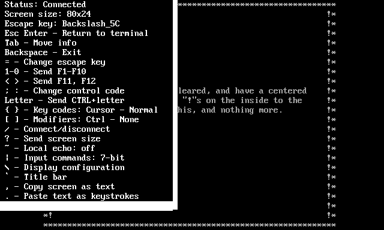

# Terminal

TextPaint provides simple terminal, whis can be used to test ANSI interpreter compatibility with VTxxx/ANSI terminal\. Terminal supports following connection types:

* **CMD** \- System command with redirecting standard input, output and error streams\.
* **TELNET** \- Network connection using Telnet protocol\.
* **RAWNET** \- Network connection without using any protocol\.

Additionally, you can use internal VTTEST for simulate terminal connection without any real connection\.

# Connection list

In the **\!\!config\.txt** file, you can predefine connection list\. Each item consists of four following parameters:

* **Name** \- Name visible on the screen before connection\.
* **Type** \- Connection type\. For **TELNET**, you can additionally define the automatically sending window size by suffinxing the type name with number\. For example, if you define type as **TELNET20**, the window size will be sent automatically after **20** ticks counted from connection establishment\.
* **Addr** \- Network address with port number or full command with parameter for system command depending on type\.
* **Codec** \- Text codec used in connection\. In most cases, you have use **0** as no codec or **65001** for use UTF\-8 codec\.

If rou run terminal, at the beginning you will see the predefined connections:

You have to press the key pointing to desired connection\. The **0** key will run internal VTTEST and last key in the list will allow to input other connection parameters, which are not in the list\.

# Terminal session

After selecting the connection, you will have to, choose and press key, which will be used as escape key\.

The escape key means the key, which provides access to functions instead of sending keystroke to server\.

The escape key can be changed during the session\. After pressing the key, the session will begin and you can use the server service\.

During the session, if you press the selected escape key, the information window will popup and you will can use special keys:

* **Escape** or **=** \- Return to terminal \(close information pop\-up\)\.
* **Enter** \- Change current escape key\.
* **Tab** \- Move information window\.
* **Backspace** \- Exit to main menu\.
* **;** or **:** \- Switch number key \(number from **1** to **9** followed by **0**\) function between six states:
  * **State 1** \- Send keys from **F1** to **F10**\.
  * **State 2** \- Send keys from **F11** to **F20**\.
  * **State 3** \- Use **<** and **>** keys to send the **AnswerBack** message and use the number keys to send as following:
    * **Number 2** \- NUL \(00h\) \- **Ctrl\+2**, **Ctrl\+@**, **Ctrl\+Space**\.
    * **Number 3** \- ESC \(1Bh\) \- **Ctrl\+3**, **Ctrl\+\[**, **Ctrl\+\{**\.
    * **Number 4** \- FS \(1Ch\) \- **Ctrl\+4**, **Ctrl\+\\**, **Ctrl\+&#124;**\.
    * **Number 5** \- GS \(1Dh\) \- **Ctrl\+5**, **Ctrl\+\]**, **Ctrl\+\}**\.
    * **Number 6** \- RS \(1Eh\) \- **Ctrl\+6**, **Ctrl\+^**, **Ctrl\+~**\.
    * **Number 7** \- US \(1Fh\) \- **Ctrl\+7**, **Ctrl\+\_**, **Ctrl\+/**\.
    * **Number 8** \- DEL \(7Fh\) \- **Ctrl\+8**, **Ctrl\+?**\.
  * **State 4**, **State 5** and **State 6** \- The same as three first states, there are available other keys for send control codes instead of some functions\.
* **<** \- Send **F11** key or **AnswerBack** message\.
* **>** \- Send **F12** key or **AnswerBack** message\.
* **Letter** \- Send letter with Ctrl modifier, like Ctrl\+X\.
* **\{** or **\}** \- Change codes for function keys, arrows, and position keys\. Theere are the following settings:
  * **1** \- Cursor keys \- two variants\.
  * **2** \- Keys from F1 to F4 \- two variants\.
  * **3** \- Keys from F5 to F12 \- two variants\.
  * **4** \- Editing keys \(Ins, Del, Home, End, PgUp, PgDown\) \- three variants\.
  * **5** \- Enter key \- three variants\.
  * **6** \- Backspace key \- two variants\.
  * **7** \- Numpad keys \- two variants\.
* **\[** or **\]** \- Enable forcing modifier keys \(Control, Alt, Shift\) for function keys, editing keys and arrows\. Usable when pressing such key with modifier is neccesary for appliaction, but TextPaint does not receive such combination:
  * **1** \- Force Control\.
  * **2** \- Force Alt\.
  * **3** \- Force Shift\.
* **/** \- Connect od disconnect, depending on current state\.
* **?** \- Send screen size to server, some servers requires such information\.
* **~** \- Enable or disablo local echo\. While enabled, all printable characters, **Enter** and **Backspace** key will be sent both to server and to terminal\.
* **\\** \- ANSI processing and display parameters\.
* **\`** \- Show or hide title bar\. The title bar contains terminal title defined by appropriate XTERM command\. The VT320 status bar is not available\.
* **,** \- Copy screen to system clipboard as plain text\. The leading and trailing blank lines will be ommited\.
* **\.** \- Paste text from system clipboard as keystrokes\.

# Telnet client limitations

TextPaint has some limitations compared to other Telnet/SSH software due to architecture and applied approaches:

* Limited compatibility with VTx/ANSI terminals, the compatibility is sufficient in most cases\.
* TextPaint recognizes XTERM 256 colors and 24\-bit RGB, but these colors are converted to standard 16 colors\.
* Features, which are not supported, but rarely used:
  * Graphics in any form, including ReGIS, Sixel and Tektronix 4014\.
  * Printer\.
  * Status bar\.
  * Actions related to gryphs including DRCS and XTERM fonts\.
* For XTWINOPS command, there are assumptions and limitations:
  * Cell size in pixels for window size report or change is always 8x16\.
  * Reported window position is always \(1,1\)\.
  * Reported window state is always normal\.
  * Resizing is the only command taking any effect\.
  * Other commands \(iconify/deiconify, set position, raise/lower\) does not work, but not matter for any application/service\.
  * Window size, text area size and screen size are the same size in pixels or in characters\.
* While SGR\-Pixels mouse coordinates is enabled, the mouse sent coordinated will be rounded to block coordinates calculated as clicking in the middle of the 8x16 block\.

# Mouse operation

During telnet session, you can use mouse for copy any screen area into clipboard\. The area will be rectangular between mouse button press and release\. The area will not be highlighted\.

If the server enable any mouse events, the mouse block cursor will be shown and the mouse button events will be sent into server instead of text copying\. If you want to copy any screen area during active mouse event, you have to display pop\-up using defined escape key and drag mouse over desired screen area \(the menu text will not be copied\)\. Pop\-up display temporary disables sending mouse events\.

